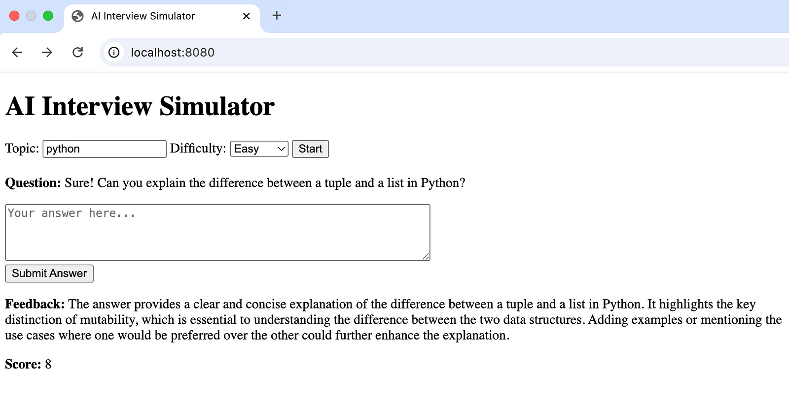

# 🤖 AI Interview Simulator

A full-stack application to help users practice technical interviews using AI. Built with **FastAPI**, **PostgreSQL**, **Docker Compose**, and will support a frontend soon.

> This is a day-by-day dev log project. Current progress: **Day 7 – Build a Minimal Frontend & Document the Project**

---

## 📌 Features

- ✅ Generate AI-powered interview questions
- ✅ Store session history with PostgreSQL
- ✅ Save answers, feedback, and scores
- ✅ Retrieve past interactions by session
- ✅ Pagination support for session logs
- ✅ Minimal frontend UI: answer, feedback, session review
- 🚧 User login/authentication (optional)

---

## 🧱 Tech Stack

- **Backend**: FastAPI + SQLAlchemy + Databases (async)
- **Database**: PostgreSQL (via Docker)
- **Containerization**: Docker & Docker Compose
- **Frontend**: HTML + JS (vanilla)

---

## 🚀 Quick Start

### 1. Clone the repository

```bash
git clone https://github.com/yourusername/interview-simulator.git
cd interview-simulator
```

### 2. Start backend + database using Docker Compose
```sh
docker compose up --build
```
This will:
* Start a PostgreSQL database (interview-db)
* Start the FastAPI backend (interview-backend) at http://localhost:8000

### 3. Initialize the database schema
After services are up:
```sh
docker compose exec backend python app/init_db.py
```
### Frontend UI
Open the frontend by visiting:
```sh
cd frontend
python3 -m http.server 8080
```
The minimal UI supports:
* Selecting a topic and difficulty
* Displaying the generated question
* Submitting an answer and viewing AI feedback

📷 UI Preview:

### 📡 API Endpoints
`POST /interview/question`
Generate a new interview question.
```sh
curl -X POST http://localhost:8000/interview/question \
  -H "Content-Type: application/json" \
  -d '{"topic": "Python", "difficulty": "medium"}'
```
Response:
```json
{
  "question": "What is the difference between a list and a tuple in Python?",
  "session_id": "abc123"
}
```
`POST /interview/feedback`
Submit your answer to the last question and receive AI feedback + score.
```sh
curl -X POST http://localhost:8000/interview/feedback \
  -H "Content-Type: application/json" \
  -d '{"session_id": "abc123", "answer": "Lists are mutable, tuples are not."}'
  ```
Response:
```json
{
  "feedback": "Great answer! You correctly highlighted the mutability difference.",
  "score": 8
}
```
`GET /session/{session_id}`
Retrieve full session history (questions, answers, feedback, scores). Supports pagination.
```sh
curl "http://localhost:8000/session/abc123?skip=0&limit=5"
```
Response:
```json
{
  "session_id": "abc123",
  "interactions": [
    {
      "question": "...",
      "answer": "...",
      "feedback": "...",
      "score": 7,
      "timestamp": "2025-06-03T10:30:45Z"
    },
    ...
  ],
  "pagination": {
    "skip": 0,
    "limit": 5,
    "count": 5
  }
}
```
### 🧪 Development Setup (No Docker)
If you prefer to run locally without Docker:
Create and activate a virtual environment:
```bash
python -m venv venv
source venv/bin/activate
```
Install dependencies:
```bash
pip install -r backend/requirements.txt
```
Start PostgreSQL locally (update .env if needed)

Run the app:
```bash
uvicorn app.main:app --reload
```
### 📂 Project Structure
```bash
interview_simulator/
│
├── backend/
│   ├── app/
│   │   ├── main.py              # FastAPI entrypoint
│   │   ├── db.py                # DB connection setup
│   │   ├── models.py            # SQLAlchemy models
│   │   ├── utils.py             # Question & feedback logic
│   │   ├── init_db.py           # Schema initializer
│   └── requirements.txt
├── frontend/
│   ├── index.html
│   └── app.js
├── docker-compose.yml           # Backend + PostgreSQL services
├── Dockerfile                   # FastAPI backend container
├── .env                         # Environment variables
└── README.md
```
### ✅ Day-by-Day Progress
| Day  | Summary                                        |
|------|-----------------------------------------------|
| Day 1 | Set up FastAPI backend                       |
| Day 2 | Add interview question generation           |
| Day 3 | Dockerize backend                           |
| Day 4 | Add feedback & scoring logic                |
| Day 5 | Add PostgreSQL + Docker Compose             |
| Day 6 | Persist feedback & scores, enhance session logs |
| Day 7 | Build minimal frontend |


### 🛠️ Roadmap
* Add styled frontend or React version
* User authentication (optional)
* Topic-based scoring analytics
* Export session history as PDF/CSV
* Role-Specific Question Banks

### 🧑‍💻 Author
Dinh Nguyen Duc
Software Engineer (AI Infrastructure, MLOps, DevOps)
🇯🇵 Based in Tokyo | 🌐 English, Japanese, Vietnamese


