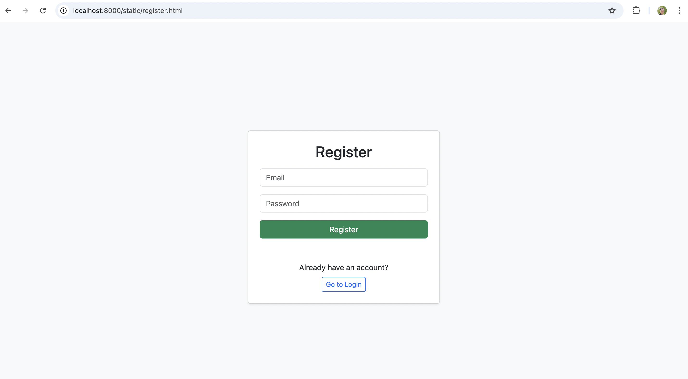
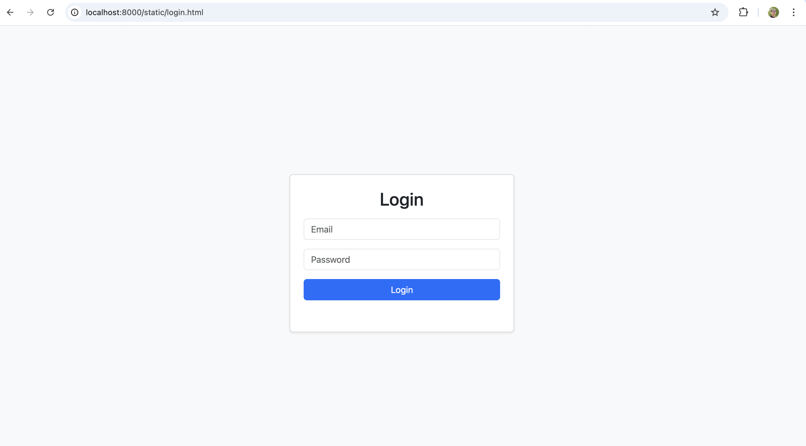
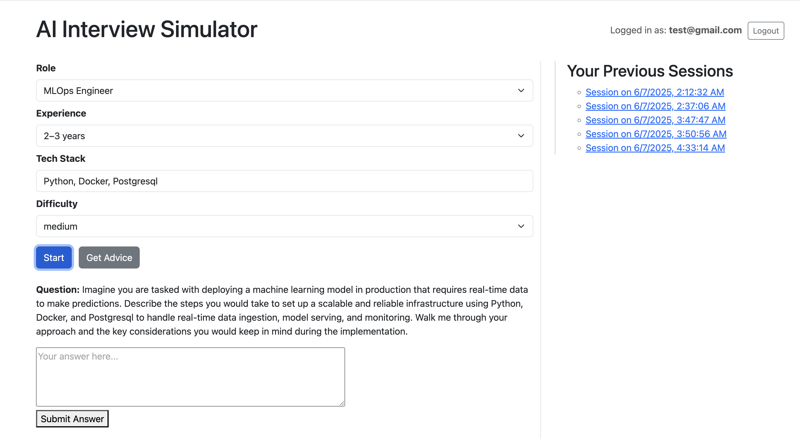

# 🧠 AI Interview Simulator

An AI-powered web app to simulate technical interviews, provide real-time feedback, and help users improve through personalized advice.

> Built with **FastAPI**, **LLM (OpenAI)**, **PostgreSQL**, and **Vanilla JS** frontend.

---

## 🔥 Features

### ✅ Interview Simulation
- Get role-specific questions based on:
  - Selected **Job Role**, **Years of Experience**, **Tech Stack**, and **Difficulty**.
- Submit answers and receive:
  - **AI-generated feedback**
  - **Score**
  - Follow-up questions

### 🧑‍💻 User Authentication
- Register, Login, and Logout (using cookies/session)
- User state persists across pages
- Authenticated users:
  - Can view session history
  - Get personalized advice

### 📜 Session History
- View all your previous interview sessions
- Click a session to expand full details:
  - Questions, answers, feedback, scores, and timestamps

### 🧠 AI-Powered Improvement Advice
- Users can request personalized advice after answering
- Advice is structured, markdown-styled, and shows how to improve future answers

### 🛠️ Persistent Context
- After login, your **role**, **experience**, and **tech stack** are automatically filled
- Sessions are linked to your account (via secure cookies)

---

## 🏗️ Tech Stack

| Layer        | Tools                            |
|--------------|----------------------------------|
| Backend      | FastAPI, SQLAlchemy, PostgreSQL  |
| LLM          | OpenAI GPT-4                     |
| Frontend     | Vanilla JavaScript + HTML/CSS    |
| Auth         | Cookie-based using fastapi-login |
| Deployment   | Docker, Docker Compose           |

---

## 🚀 Quick Start

### 1. Clone the repository

```bash
git clone https://github.com/yourusername/interview-simulator.git
cd interview-simulator
```

### 2. Start backend + database using Docker Compose
```sh
docker compose up --build -d
```
This will:
* Start a PostgreSQL database (interview-db)
* Start the FastAPI backend (interview-backend) at http://localhost:8000

### 3. Initialize the database schema
After services are up:
```sh
docker compose exec backend python app/init_db.py
```
### Frontend UI
After starting the project (docker compose up --build), access the web interface via:

🔐 Register: http://localhost:8000/static/register.html

🔑 Login: http://localhost:8000/static/login.html

🧠 Main App: http://localhost:8000/static/index.html

The UI is built with vanilla HTML, CSS, and JavaScript, designed for clarity and responsiveness.

### 📷 UI Preview:
🔐 Register:


🔑 Login:


🧠 Main App:


### 📂 Project Structure
```bash
interview_simulator/
├── docker-compose.yml             # Orchestrates backend + frontend
├── Dockerfile                     # Backend Docker build
├── README.md                      # Project documentation
├── cookie.txt                     # Debugging cookie storage
├── images/                        # UI screenshots
│   ├── 250601_UI_preview.png
│   └── 250607_UI_preview.png
├── notes/                         # Development logs & planning
├── frontend/                      # Static frontend files (served by backend)
│   ├── index.html
│   ├── login.html
│   ├── register.html
│   ├── styles.css
│   └── app.js
├── backend/
│   ├── Dockerfile
│   ├── requirements.txt
│   ├── frontend/                  # Mounted frontend folder (for serving static files)
│   └── app/
│       ├── main.py                # FastAPI app entry point
│       ├── db.py, models.py       # DB config & schema
│       ├── auth.py                # User authentication
│       ├── init_db.py             # Database initializer script
│       ├── services/              # Core business logic
│       ├── routes/                # API route definitions
│       └── utils.py               # Helper functions
```

### ✅ Day-by-Day Progress
| Day  | Summary                                        |
|------|-----------------------------------------------|
| Day 1 | Set up FastAPI backend                       |
| Day 2 | Add interview question generation           |
| Day 3 | Dockerize backend                           |
| Day 4 | Add feedback & scoring logic                |
| Day 5 | Add PostgreSQL + Docker Compose             |
| Day 6 | Persist feedback & scores, enhance session logs |
| Day 7 | Build minimal frontend |
| Day 8	| Add user authentication with fastapi-login |
| Day 9	| Implement login/register frontend, session history, and logout |
| Day 10	| Improve interview prompt realism (role, experience, tech stack), show session details, provide improvement advice, and style UI with Bootstrap |

### 🎯 Upcoming Features (Ideas)
 * Visual analytics: performance over time
 * Export sessions as PDF reports
 * Explore methods to enhance both speed and precision to better align with user needs.

#### 🔥 Project-Based Interview Assessment
- Users can provide details about their projects.
- The AI will evaluate the user's understanding and contributions.
- A scoring system will assess depth of knowledge and impact.

#### 🔥 LeetCode-Style Practice
- Role-specific coding challenges with adjustable difficulty.
- Hint system offering **Hint 1**, **Hint 2**, **Hint 3**, an **Idea**, and the **Answer**.
- AI-generated feedback on solutions with scoring and improvement suggestions.

### 🧑‍💻 Author
Dinh Nguyen Duc
Software Engineer (AI Infrastructure, MLOps, DevOps)
🇯🇵 Based in Tokyo | 🌐 English, Japanese, Vietnamese


